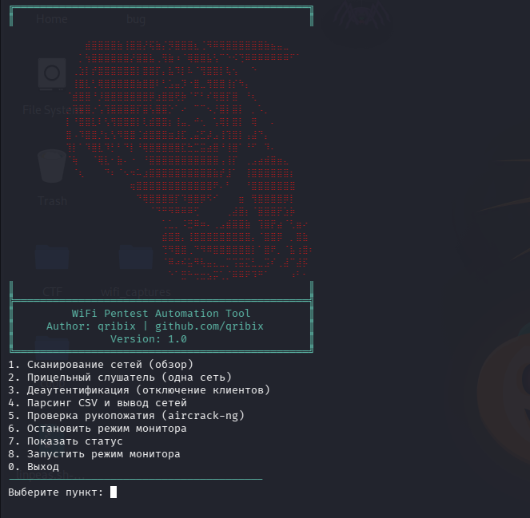
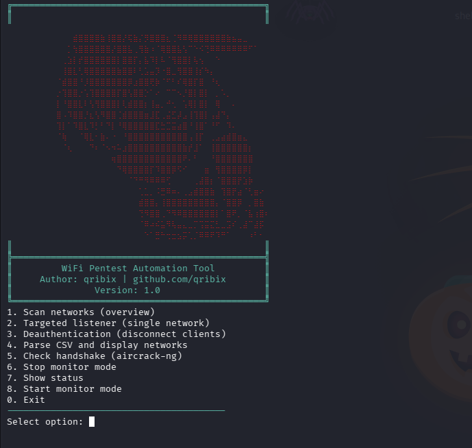

# 📡 WiFi Pentest Automation Tool

<div align="center">
  
  **🌐 English | Русский**
  
  [⬇️ Jump to English version](#english-version) • [⬇️ Перейти к русской версии](#russian-version)
  
</div>

##

#  Русская версия <a name="russian-version"></a>

Интерактивный Bash-инструмент для автоматизации задач при работе с беспроводными сетями с использованием Aircrack-ng.

Скрипт объединяет наиболее востребованные операции в одном меню и избавляет от необходимости постоянно вводить длинные команды вручную.

## ✨ Возможности

* 📶 Сканирование Wi-Fi сетей
* 🎯 Прицельный захват трафика выбранной точки доступа
* 📡 Управление monitor mode
* 📂 Сохранение файлов захвата
* 🔍 Парсинг CSV-файлов Airodump-ng
* 🤝 Проверка наличия WPA/WPA2 Handshake
* 📊 Просмотр состояния интерфейсов
* ⚡ Быстрый запуск deauthentication-тестов

## 🖥️ Меню



## 🔧 Зависимости

* Bash
* Aircrack-ng
* Адаптер с поддержкой monitor mode

## 🚀 Установка для русской версии

```bash
git clone https://github.com/qribix/security-scripts.git
cd security-scripts/wifi-toolkit
chmod +x wifi-ru.sh 
```

## ▶️ Запуск

```bash
sudo ./wifi-ru.sh
```

## ⚙️ Настройка

Перед запуском при необходимости измените параметры в начале скрипта:

```bash
INTERFACE="wlan1"
CAPTURE_DIR="/home/kali/Desktop/wifi_captures"
```

## 📁 Файлы захвата

По умолчанию результаты сохраняются в:

```text
/home/kali/Desktop/wifi_captures
```

#  English Version <a name="english-version"></a>


Interactive Bash tool for automating wireless network tasks using Aircrack-ng.

The script combines the most common operations in a single menu, eliminating the need to manually type long commands.

## ✨ Features

* 📶 Wi-Fi network scanning
* 🎯 Targeted traffic capture for selected access point
* 📡 Monitor mode management
* 📂 Capture file saving
* 🔍 Airodump-ng CSV file parsing
* 🤝 WPA/WPA2 Handshake verification
* 📊 Interface status monitoring
* ⚡ Quick deauthentication tests

## 🖥️ Menu



## 🔧 Dependencies

* Bash
* Aircrack-ng
* Adapter with monitor mode support

## 🚀 Installation

```bash
git clone https://github.com/qribix/security-scripts.git
cd security-scripts/wifi-toolkit
chmod +x wifi-en.sh
```

## ▶️ Run

```bash
sudo ./wifi-en.sh
```

## ⚙️ Configuration

Before running, modify parameters at the beginning of the script if needed:

```bash
INTERFACE="wlan1"
CAPTURE_DIR="/home/kali/Desktop/wifi_captures"
```

## 📁 Capture Files

By default, results are saved to:

```text
/home/kali/Desktop/wifi_captures
```

## ⚠️ Disclaimer/Дисклеймер

This tool is designed for learning, research, and authorized penetration testing of wireless networks only. Use responsibly and only on networks you own or have explicit permission to test.

Инструмент разработан для обучения, исследований и авторизованного тестирования беспроводных сетей.

